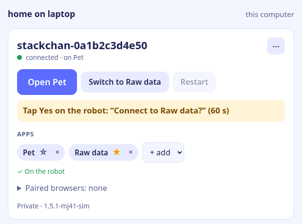
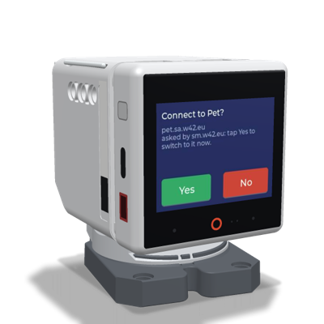
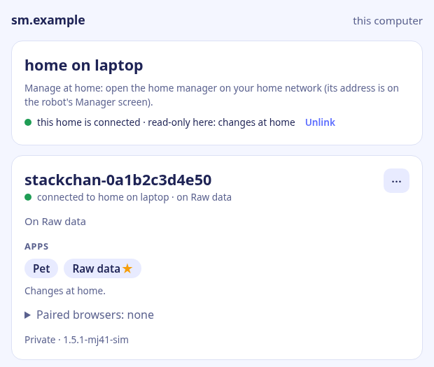

# s-w42-eu-manager

The **home manager** for Stackchan robots in Embody Mode. It runs on a computer at home, sets
robots up over USB, keeps a live line to them, switches their apps, and gives each robot its own
token for every app it approves. The apps at home ask it about those tokens when a robot
connects. No sign-in and no cloud: the computer it runs on is the owner, and a phone gets in by
scanning a code on a robot. Design:
[Stackchan sites](https://github.com/mj41/home-w42-eu/blob/main/docs/stackchan-sites.md).

A home manager may also link up to [sm.w42.eu](https://sm.w42.eu), the manager online, so that
the robots show there too. sm.w42.eu's own part (sign-in, users, one sign-in for every app,
accepting links) is not in this repository.

> **A proof of concept, vibe coded.** Written with AI agents and tested on real hardware at
> home, but neither the code nor its security has been reviewed by humans.
>
> **Early stage: no backward compatibility.** APIs, file formats and stored settings change
> when something better comes along, without migrations.

## What it does

- **One page for your robots** (`/`, [design](https://github.com/mj41/home-w42-eu/blob/main/docs/sm-ux.md)):
  each robot with its name, status (connected to this manager or not, on which app, firmware),
  **Open** for the app it starts with, its apps (★ the start app; changed online when the robot
  allows it), private or public, and its history.
- **Set up over USB** (Chrome or Edge: Web Serial): backs up the robot's firmware, installs the
  official Embody Mode firmware ([esptool-js](https://github.com/espressif/esptool-js)), and
  writes the approved apps with their tokens, the start app, Wi-Fi and the owner's choices into
  the robot; the robot asks on its screen before its start app is set. A robot plugged into the
  computer is noticed (once the browser may use it) and gets a USB strip on its card: update
  firmware, write apps, permissions. **Find a robot on USB** (next to + Add a robot) opens the
  browser's port chooser on a computer the browser was not allowed it yet. User steps:
  [SETUP.md](https://github.com/mj41/StackChan/blob/embody-mj41/firmware/main/apps/app_embody_mode/SETUP.md).
- **The robot's manager** ([manager-channel.md](https://github.com/mj41/home-w42-eu/blob/main/docs/manager-channel.md)):
  every robot set up here keeps a connection to this manager (`GET /robot`, its channel token).
  It reports its state live (which app, a question on its screen and the answer, not
  responding), and gets app lists, switches, browsers to forget and restarts, all signed with
  this manager's key. When the camera and microphone are off on the robot (set only there or
  over USB), the card says so.
- **Phones:** a phone gets in by scanning the QR code on a robot's Manager screen (the QR
  screen's gear): a one-time code the manager gives the robot, so being at the robot is the
  proof. The page then says "this phone · Sign out".
- **For apps:** `POST /api/robot-auth` checks robot tokens and passes the paired browsers on.
- **The link** (`-upstream-url https://sm.w42.eu`): the home links up to sm.w42.eu (out, so NAT
  is no problem), approved once by the owner there. sm.w42.eu then shows the home's robots live,
  read-only or with full control (the home signs what its page asks), and may issue tokens for its
  own apps to them. The home's page says "This home is linked to sm.w42.eu, connected".
- **`s-w42-eu-usb`:** the same setup from a terminal, and driving a robot over USB (automation).

| A robot on its manager's page: live, a question on its screen | The question on the robot | A linked home on sm.w42.eu (read-only) |
|---|---|---|
|  |  |  |

## How the pieces fit

| Piece | What it is | Needed? |
|---|---|---|
| **Robot** | a Stackchan with the [Embody Mode firmware](https://github.com/mj41/StackChan/tree/embody-mj41/firmware/main/apps/app_embody_mode). On its screen the **app switcher** (the QR screen: Next, Connect) lists its apps and switches between them; its gear opens the **Manager screen** (which manager it has, turn it off or on). | yes |
| **Apps** | servers the robot connects to, one at a time: [Raw data](https://github.com/mj41/s-w42-eu-raw), [Pet](https://github.com/mj41/s-w42-eu-pet), [Sbot](https://github.com/mj41/s-w42-eu-sbot), … | at least one |
| **Phone or browser** | opens an app's page and pairs with the robot by scanning its QR code; with end-to-end encryption only paired browsers can read the robot | to use an app |
| **Manager** | this repo: the web service that sets robots up over USB, gives each robot its own token per app, and switches and changes apps from its page | optional: without it, apps are written over USB and switched on the robot's app switcher |

"Manager" always means this web service; on the robot there is only the app switcher and the
Manager screen that shows which manager it has.

**Principles:** apps are separate; USB or the manager delivers and removes a robot's apps; the
manager is optional (off on the robot or by the manager itself, on again only on the robot or
over USB); switching apps is always possible on the robot's QR screen.

## Run

```bash
go run ./cmd/s-w42-eu-manager -apps-file ~/.config/s-w42-eu-manager/apps.json
# then open http://localhost:8790 on this computer
```

Only the browser on the manager's own computer may use the page (loopback address and host name,
no proxy in between), plus phones signed in at a robot. It is the owner of every robot set up
there, and the page fills in the Wi-Fi that computer is on. Robots and phones reach the manager at
this computer's LAN address.

Flags (`-h` for all):

- `-listen` (`:8790`), `-tls-listen` (also HTTPS, self-signed if needed: Web Serial needs a secure
  page, which `localhost` already is).
- `-apps-file` (`~/.config/s-w42-eu-manager/apps.json`).
- `-state-file` (`~/.local/state/s-w42-eu-manager/state.json`), or `-state-database` (Postgres
  through s-w42-eu-raw's `statestore`).
- `-signing-key-file` (signs the robots' app lists; created if missing).
- `-firmware-release` (`latest`, a tag, or `""`) or `-firmware-dir`.
- `-name`, `-robot-url`, `-page-url` (what robots and the Manager screen get; this computer's LAN
  address by default).
- `-upstream-url` (the link, e.g. `https://sm.w42.eu`).
- `-ui-dir` (development), `-debug`.

## The app catalog

A JSON list. An app that checks tokens with the manager has a `secret_file` (its credential for
`robot-auth`); every robot gets a token of its own. An app that accepts one shared robot token
has a `token_file` instead, and every robot gets that token. An app another manager set the robot
up for has `"robot_token": true`: the robot keeps the token it has. A relay whose app runs in the
browser (Raw data) may have `"e2e": true`: every robot that gets it turns end-to-end encryption on
for it, so the app's server sees only ciphertext
([e2ee.md](https://github.com/mj41/home-w42-eu/blob/main/docs/e2ee.md) §7).

```json
[
  {"id": "raw", "name": "Raw data", "url": "ws://192.168.1.10:8765", "secret_file": "/home/me/.config/s-w42-eu-manager/raw-secret", "e2e": true},
  {"id": "sbot", "name": "Sbot", "url": "ws://192.168.1.10:8780", "token_file": "/home/me/.config/s-w42-eu-manager/sbot-token"}
]
```

Ids: lowercase letters, digits and `-`. `web` (optional) is the app's page for people; by default
the `url` with `http://` or `https://`. The app gets the same secret (e.g. s-w42-eu-raw's
`-manager-url http://localhost:8790 -manager-secret-file …`).

## API

| Endpoint | Purpose |
|---|---|
| `GET /api/me` | this manager's name, the catalog (a linked home also lists sm.w42.eu's apps as `up:<id>`), the link; for this computer or a signed-in phone: the robots with their live state (online, `last_app`, `question`, `answer`, `stuck`, paired browsers) and this computer's Wi-Fi |
| `POST /api/my/robots/{id}/setup` | `{"apps", "start", "remote_apps", "ask_pin", "second"}`: add the robot (or update it) and get what the USB setup writes (`servers` with their tokens, `start`, `manager`, `manager2`?); new tokens each time; `second`: the linked sm.w42.eu as the robot's second manager |
| `POST /api/my/robots/{id}/apps` | `{"apps", "start"}`: change the apps (robots set up with remote changes allowed): a signed `Apps` on its channel |
| `POST /api/my/robots/{id}/switch` | `{"app"}`: a signed `Switch`; the robot asks on its screen with `ask_pin` |
| `POST /api/my/robots/{id}/restart` | a signed `Restart` |
| `POST /api/my/robots/{id}/disable` | this manager turns itself off for the robot; only the robot's Manager screen or a USB setup turns it on again |
| `POST /api/my/robots/{id}/name`, `…/access` | `{"name"}`; `{"public": bool}` |
| `POST /api/my/robots/{id}/pairings/remove` | `{"app", "id"}` or `{"app", "all": true}`: unpair browsers (an end-to-end browser is also forgotten by the robot) |
| `DELETE /api/my/robots/{id}` | remove a robot: all its tokens stop working |
| `GET /robot` | the robot's manager channel (WebSocket; `X-Device-Id`, `Authorization: Bearer <channel token>`): robot → `Hello`, `State`; manager → `Signed {payload, sig}` (Apps, Switch, Forget, Restart), `Ping` |
| `GET /phone?code=…`, `POST /auth/logout` | a phone that scanned the one-time code on a robot's Manager screen is signed in; signing it out |
| `POST /api/link/start`, `GET /link/done`, `POST /api/link/settings`, `POST /api/link/unlink` | the link: start (→ the approval URL upstream), back with the code, `{"mode": "read-only"\|"full", "share_local"}`, unlink |
| `POST /api/robot-auth` | for apps, with `Authorization: Bearer <the app's secret>`: `{"robot", "token", "seen"?}` → `{"ok", "owner", "owner_name", "public", "cache_s", "unpair"?}` |
| `GET /firmware/{file}` | the official firmware for the setup page |

Tokens: 64 hex characters; the manager keeps only their SHA-256. An app caches an answer for
`cache_s` (60 s), so a removed robot's token works for at most a minute more on new connections.

## Testing

`go test ./...`. `go test ./e2e` runs the page in headless Chrome against a manager with a test
catalog and a fake robot on Web Serial ([e2e/fakeserial.js](e2e/fakeserial.js)), and a fake
upstream for the link (`internal/upstreamsim`). Without Chrome it is skipped (`CHROME=…` names
one); `E2E_SHOTS=<dir>` saves a screenshot of each step. Flashing needs a real robot:
`s-w42-eu-usb` below.

## Over USB from a terminal: s-w42-eu-usb

```bash
go run ./cmd/s-w42-eu-usb hello
go run ./cmd/s-w42-eu-usb status                     # its server, the connection, the QR screen, its apps
go run ./cmd/s-w42-eu-usb log -seconds 60 -grep qr   # the robot's log (without the periodic lines)
go run ./cmd/s-w42-eu-usb provision -url ws://192.168.1.10:8765 -name Raw -token-file token.txt -default -autostart
go run ./cmd/s-w42-eu-usb pair                       # the robot's pairing link
# with automation in the firmware (the release has it): what a person at the robot does
go run ./cmd/s-w42-eu-usb screenshot -o screen.jpg
go run ./cmd/s-w42-eu-usb tap -x 268 -y 25          # the first tap asks on the robot's screen
go run ./cmd/s-w42-eu-usb launch -app "Embody Mode"
```

## License

MIT, see [LICENSE](LICENSE).

Stack-chan (スタックチャン) is a registered trademark of Shinya Ishikawa; this project is
independent and only made to work with [Stack-chan](https://github.com/stack-chan/stack-chan) robots.
